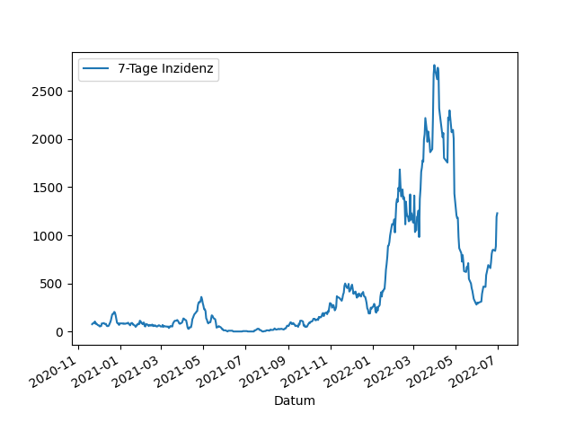

---
# this is an empty front matter - necessary for Jekyll
---

## Aktuelle Daten

Die aktuelle Inzidenz vom {{ "now" | date: "%d.%m.%Y }} liegt bei 

## Historie der Infektionen

## Historie der 7-Tage-Inzidenz

